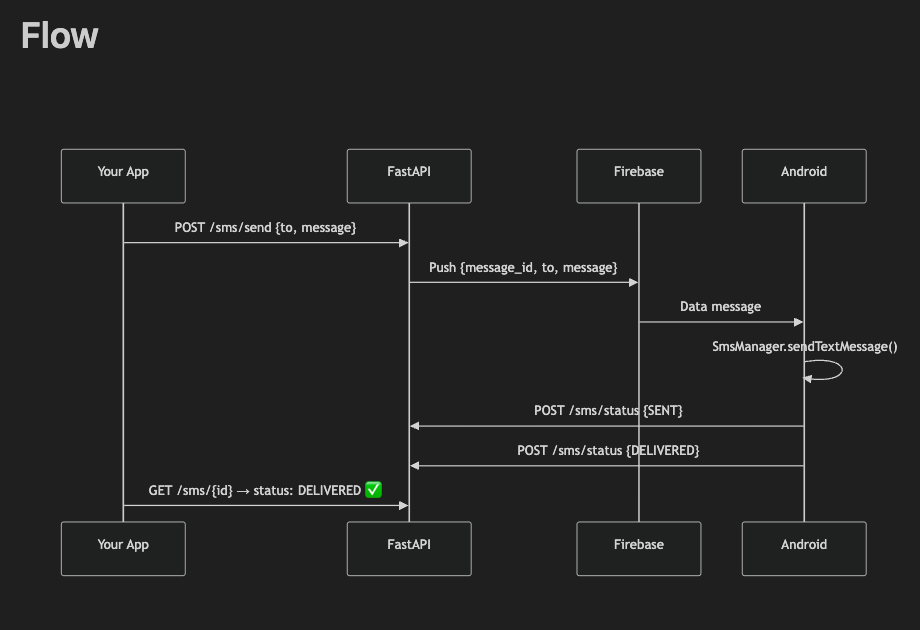

# SMS Bridge


A robust, self-hosted SMS gateway solution that transforms your Android device into a programmable SMS sending engine. Built with **FastAPI** and **Kotlin**, leveraging **Firebase Cloud Messaging** for real-time push delivery.

---

##  Table of Contents

- [Architecture](#-architecture)
- [Features](#-features)
- [Tech Stack](#-tech-stack)
- [Prerequisites](#-prerequisites)
- [Installation](#-installation)
  - [Backend Setup](#backend-setup)
  - [Android Setup](#android-setup)
- [API Reference](#-api-reference)
- [Troubleshooting](#-troubleshooting)
- [License](#-license)

---

##  Architecture

The system uses a push-based architecture to ensure low latency and battery efficiency. The Android app does not poll the server; instead, it waits for high-priority FCM data messages to trigger SMS sending.



---

##  Features

-  **Smart Routing**: Automatically routes SMS to the most recently active device.
-  **Failover Logic**: Sequentially tries multiple devices if one is offline or times out (10s max wait).
-  **Daily Limits**: Enforces a daily SMS limit (default 90) per device to prevent spam/blocking.
-  **Real-time Delivery**: Uses FCM for instant message delivery (sub-5s latency).
-  **Status Tracking**: Granular status updates: `QUEUED` → `SENT` → `DELIVERED` (or `FAILED` with specific error).
-  **Feedback Loop**: Synchronous API response (`SENT` or `FAILED`) for better UX.

---

##  Tech Stack

**Backend**
- **Framework**: FastAPI (Python)
- **Database**: SQLite (via SQLAlchemy)
- **Push Notifications**: Firebase Admin SDK
- **Containerization**: Docker & Docker Compose

**Mobile**
- **OS**: Android (Min SDK 26)
- **Language**: Kotlin
- **Networking**: OkHttp + WorkManager (Heartbeats)
- **Background Work**: Firebase Messaging Service

---

##  Prerequisites

- **Docker Desktop** (Recommended) OR **Python 3.9+**.
- **Android Device** (Android 8.0 Oreo or higher).
- **Firebase Project**:
  - `service-account.json` (Place in root for Backend)
  - `google-services.json` (Place in `android/app/` for Android App)

---

##  Installation

### Option 1: Docker (Recommended)

1. **Clone & Setup Config**
   ```bash
   git clone <your-repo-url>
   cd sms_gateway
   # Place your service-account.json in this directory
   ```

2. **Run with Docker Compose**
   ```bash
   docker-compose up --build -d
   ```
   The API will be available at `http://localhost:9000`.

### Option 2: Manual Python Setup

1. **Install Dependencies**
   ```bash
   pip install -r requirements.txt
   ```

2. **Run Server**
   ```bash
   # Make sure to set environment variables or use .env
   uvicorn app.main:app --host 0.0.0.0 --port 9000
   ```

### Android Setup

1. **Download APK**:
   Go to `http://localhost:9000/static/sms-gateway.apk` (or use your machine's IP, e.g., `http://192.168.1.100:9000/...`).
2. **Install & Register**:
   - Open App.
   - Enter Server URL (e.g., `http://192.168.1.100:9000`).
   - Tap **Register**.
   - **Grant Permissions** (SMS, Notifications).

---

##  API Reference

Interactive docs: `http://localhost:9000/docs`

### 1. Send SMS (Smart Dispatch)
**Endpoint**: `POST /sms/dispatch`

**Headers**: `X-API-Key: <your_api_key>` (Optional if using device key, but good practice)

**Body**:
```json
{
  "to": "+1234567890",
  "message": "Hello via Smart Routing!"
}
```
**Response**:
`{"status": "SENT"}` or `{"status": "FAILED"}` (Waits up to 10s for confirmation).


### 2. Check Message Status
**Endpoint**: `GET /sms/{message_id}`

**Response**:
```json
{
  "id": "uuid",
  "status": "DELIVERED",
  "sent_at": "2024-03-20T10:00:00",
  "error": null
}
```

### 2. Check Message Status
**Endpoint**: `GET /sms/{message_id}`

**Response**:
```json
{
  "id": "uuid",
  "status": "DELIVERED",
  "sent_at": "2024-03-20T10:00:00",
  "delivered_at": "2024-03-20T10:00:05"
}
```

### 3. List Devices
**Endpoint**: `GET /devices/`

**Response**:
```json
[
  {
    "id": "uuid",
    "name": "Google Pixel 8",
    "api_key": "sg_..."
  }
]
```

---

##  Troubleshooting

| Issue | Solution |
|-------|----------|
| **Server Unreachable** | Ensure phone and server are on the same WiFi network. Use your local IP (e.g., `192.168.x.x`), not `localhost`. |
| **Permission Denied** | On Android 13+, you may need to manually enable "Allow restricted settings" for the app in system settings if installed via APK. |
| **Message Pending/Queued** | Check if the phone has internet access and can receive FCM notifications. Verify `API Key` in `service-account.json`. |
| **Cleartext Traffic Error** | If using HTTP, ensure `android:usesCleartextTraffic="true"` is set in `AndroidManifest.xml` (already configured in this project). |

---

## License

This project is licensed under the MIT License - see the [LICENSE](LICENSE) file for details.
