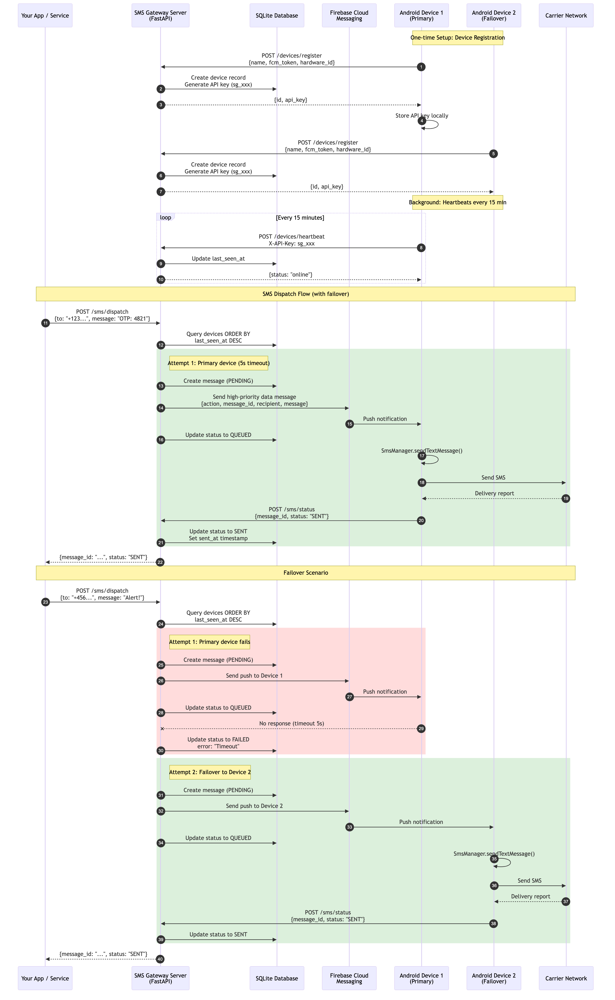

# SMS Gateway

A self-hosted SMS gateway that turns Android phones into programmable SMS senders. Instead of paying per-message fees to services like Twilio or MessageBird, this system routes messages through your own Android devices using their native SMS capability.

The server receives API requests, picks the best available device, and delivers a Firebase Cloud Messaging (FCM) push notification that wakes the device and triggers SMS transmission in real time. Delivery status is reported back to the server synchronously, so the API caller gets an immediate SENT or FAILED response without polling.

## Why This Exists

Paid SMS APIs charge per message and require business verification. For internal tools, OTP delivery, notifications, or any use case where you control the sending devices, this project gives you:

- Zero per-message cost (uses your carrier plan)
- Full data ownership (nothing leaves your infrastructure except the SMS itself)
- No vendor approval process
- Multi-device failover (register several phones, the system routes around failures)

## How It Works



The diagram above covers the complete flow:

1. **Device registration** - Each Android device registers with the server and receives a unique API key.
2. **Heartbeats** - Devices ping the server every 15 minutes so it knows which are online.
3. **SMS dispatch** - Your app calls `POST /sms/dispatch`. The server picks the most recently active device, sends an FCM push, and the device transmits the SMS via the native Android SMS API.
4. **Status callback** - The device reports SENT/DELIVERED/FAILED back to the server, which returns the result to the original caller.
5. **Failover** - If a device times out (5 seconds per device, 10 seconds total), the server automatically retries with the next available device.

## Features

- **Smart routing** with automatic failover across multiple registered devices
- **Synchronous dispatch** that returns the final delivery status in a single request
- **Real-time status tracking** with granular states: PENDING, QUEUED, SENT, DELIVERED, FAILED
- **Client-side rate limiting** (90 SMS/day per device) to avoid carrier blocking
- **Battery efficient** push-based architecture (no polling on the device)
- **Device heartbeats** every 15 minutes so the server knows which devices are online
- **Hardware ID persistence** so devices survive app reinstalls without re-registration

## Tech Stack

### Backend

- **Framework:** FastAPI (Python 3.11)
- **Database:** SQLite via SQLAlchemy
- **Push notifications:** Firebase Admin SDK (FCM)
- **Deployment:** Docker and Docker Compose

### Android Client

- **Language:** Kotlin
- **Min SDK:** 26 (Android 8.0)
- **HTTP:** OkHttp
- **Background work:** WorkManager (heartbeats), FirebaseMessagingService (SMS triggers)

## Prerequisites

- Docker (recommended) or Python 3.11+
- An Android device running Android 8.0+ with Google Play Services
- A Firebase project with Cloud Messaging enabled

## Firebase Setup

You need two credential files from Firebase: a `service-account.json` for the backend server and a `google-services.json` for the Android app.

### Step 1: Create a Firebase Project

1. Go to the [Firebase Console](https://console.firebase.google.com/).
2. Click **Add project** (or select an existing project).
3. Enter a project name and follow the prompts. You can disable Google Analytics if you do not need it.
4. Click **Create project**.

### Step 2: Get `service-account.json` (Backend)

This file lets the server authenticate with Firebase to send push notifications.

1. In the Firebase Console, click the gear icon next to **Project Overview** and select **Project settings**.
2. Go to the **Service accounts** tab.
3. Under the "Firebase Admin SDK" section, make sure **Python** is selected.
4. Click **Generate new private key**.
5. Confirm by clicking **Generate key**. A JSON file will download.
6. Rename the downloaded file to `service-account.json` and place it in the project root directory (next to `docker-compose.yml`).

Keep this file secret. It grants full admin access to your Firebase project. Do not commit it to version control.

### Step 3: Get `google-services.json` (Android)

This file connects the Android app to your Firebase project for receiving push notifications.

1. In the Firebase Console, go to **Project settings**.
2. Under the **General** tab, scroll down to **Your apps**.
3. Click the Android icon to add an Android app.
4. Enter `com.smsgateway` as the package name.
5. Click **Register app**.
6. Download the `google-services.json` file.
7. Place it in the `android/app/` directory (replacing the existing one if present).

### Step 4: Enable Cloud Messaging

1. In the Firebase Console, go to **Project settings** then the **Cloud Messaging** tab.
2. Ensure the **Firebase Cloud Messaging API (V1)** is enabled. If it shows "Disabled", click the three-dot menu and enable it.

## Installation

### Option 1: Docker (Recommended)

```bash
# Clone the repository
git clone <repository-url>
cd sms-gateway

# Place your service-account.json in the project root (see Firebase Setup above)

# Build and start the server
docker-compose up --build -d
```

The API will be available at `http://localhost:9000`. Interactive API docs are at `http://localhost:9000/docs`.

### Option 2: Manual Setup

```bash
# Create and activate a virtual environment
python -m venv venv
source venv/bin/activate

# Install dependencies
pip install -r requirements.txt

# Copy the example environment file and edit if needed
cp .env.example .env

# Place your service-account.json in the project root

# Start the server
uvicorn app.main:app --host 0.0.0.0 --port 9000
```

### Android Client

1. With the backend running, download the APK from your server:
   `http://<SERVER_IP>:9000/static/sms-gateway.apk`
2. Install the APK on your Android device (enable "Install from unknown sources" if prompted).
3. Open the app and enter your server URL (e.g., `http://192.168.1.100:9000`). Use the server's LAN IP, not `localhost`.
4. Tap **Register Device**.
5. Grant the SMS and notification permissions when prompted.
6. The app will display a generated API key. Save this key for authenticating API requests.

If you want to build the Android app from source, open the `android/` directory in Android Studio. Make sure your `google-services.json` is in `android/app/` before building.

## Usage

### Sending an SMS (Smart Dispatch)

This is the primary endpoint. It picks the best device, sends the message, and waits for confirmation.

```bash
curl -X POST http://localhost:9000/sms/dispatch \
  -H "Content-Type: application/json" \
  -d '{"to": "+1234567890", "message": "Your verification code is 4821"}'
```

Response (returns after device confirms delivery, up to 10 seconds):

```json
{
  "message_id": "550e8400-e29b-41d4-a716-446655440000",
  "status": "SENT"
}
```

### Sending to a Specific Device

Requires the `X-API-Key` header from device registration.

```bash
curl -X POST http://localhost:9000/sms/send \
  -H "Content-Type: application/json" \
  -H "X-API-Key: sg_your_api_key_here" \
  -d '{
    "to": "+1234567890",
    "message": "Hello from a specific device",
    "device_id": "device-uuid-here"
  }'
```

### Checking Message Status

```bash
curl http://localhost:9000/sms/{message_id} \
  -H "X-API-Key: sg_your_api_key_here"
```

```json
{
  "id": "550e8400-e29b-41d4-a716-446655440000",
  "device_id": "device-uuid",
  "recipient": "+1234567890",
  "body": "Your verification code is 4821",
  "status": "DELIVERED",
  "error": null,
  "created_at": "2025-01-15T10:00:00",
  "sent_at": "2025-01-15T10:00:01",
  "delivered_at": "2025-01-15T10:00:03",
  "failed_at": null
}
```

### Listing Recent Messages

```bash
curl http://localhost:9000/sms/?limit=20 \
  -H "X-API-Key: sg_your_api_key_here"
```

### Listing Registered Devices

```bash
curl http://localhost:9000/devices/
```

### Deleting a Device

```bash
curl -X DELETE http://localhost:9000/devices/{device_id}
```

### Health Check

```bash
curl http://localhost:9000/health
```

Returns `{"status": "ok"}` when the server is running.

## API Reference

Full interactive documentation is available at `http://localhost:9000/docs` (Swagger UI) when the server is running.

### Endpoints Summary

| Method | Path | Auth | Description |
|--------|------|------|-------------|
| POST | `/sms/dispatch` | None | Smart dispatch with automatic device selection and failover |
| POST | `/sms/send` | API Key | Send SMS through a specific device |
| POST | `/sms/status` | Device Token | Status callback (used internally by the Android app) |
| GET | `/sms/{message_id}` | API Key | Get status of a specific message |
| GET | `/sms/` | API Key | List recent messages |
| POST | `/devices/register` | None | Register a new Android device |
| POST | `/devices/heartbeat` | API Key | Device heartbeat (called automatically by the Android app) |
| GET | `/devices/` | None | List all registered devices |
| DELETE | `/devices/{device_id}` | None | Remove a registered device |
| GET | `/health` | None | Server health check |

### Authentication

Endpoints marked with "API Key" require an `X-API-Key` header. The key is generated when a device registers and follows the format `sg_<hex>`. Example:

```
X-API-Key: sg_a1b2c3d4e5f67890abcdef1234567890
```

The `/sms/status` endpoint is authenticated by the device's FCM token (passed in the request body) rather than an API key. This endpoint is only called by the Android app.

### Message Statuses

| Status | Meaning |
|--------|---------|
| PENDING | Message created, FCM push not yet sent |
| QUEUED | FCM push delivered to device, SMS not yet sent |
| SENT | Device confirmed the SMS was sent |
| DELIVERED | Carrier confirmed delivery to the recipient |
| FAILED | SMS sending failed (check the `error` field for details) |

## Configuration

### Environment Variables

| Variable | Default | Description |
|----------|---------|-------------|
| `FIREBASE_SERVICE_ACCOUNT_PATH` | `./service-account.json` | Path to the Firebase service account credentials file |
| `DATABASE_URL` | `sqlite:///./sms_gateway.db` | SQLAlchemy database connection string |
| `API_HOST` | `0.0.0.0` | Host address the server binds to |
| `API_PORT` | `9000` | Port the server listens on |

When using Docker, these are set in `docker-compose.yml`. For manual setup, copy `.env.example` to `.env` and edit as needed.

## Project Structure

```
sms_gateway/
├── app/
│   ├── main.py              # FastAPI app, CORS, router registration, startup
│   ├── config.py            # Environment variable configuration
│   ├── database.py          # SQLAlchemy engine and session setup
│   ├── models.py            # Device and Message database models
│   ├── schemas.py           # Pydantic request/response schemas
│   ├── auth.py              # API key authentication
│   ├── firebase.py          # Firebase Admin SDK init and FCM push
│   └── routers/
│       ├── sms.py           # SMS dispatch, send, status, and listing endpoints
│       └── devices.py       # Device registration, heartbeat, listing, deletion
├── android/                 # Android Studio project (Kotlin)
│   └── app/
│       └── src/main/java/com/smsgateway/
│           ├── MainActivity.kt        # Registration UI
│           ├── SmsFcmService.kt       # FCM message handler, triggers SMS
│           ├── SmsStatusReceiver.kt   # Broadcast receiver for delivery reports
│           ├── SmsLimitManager.kt     # Daily SMS limit enforcement
│           └── HeartbeatWorker.kt     # Periodic heartbeat via WorkManager
├── static/
│   └── sms-gateway.apk     # Pre-built Android APK
├── Dockerfile
├── docker-compose.yml
├── requirements.txt
├── .env.example
└── service-account.json     # Your Firebase credentials (not committed)
```

## Troubleshooting

**Server unreachable from Android device:**
Make sure the phone and server are on the same network. Use the server's LAN IP (e.g., `192.168.x.x`), not `localhost` or `127.0.0.1`.

**FCM push notifications not arriving:**
Verify that `service-account.json` is valid and placed in the correct path. In the Firebase Console, confirm that Cloud Messaging API (V1) is enabled. On the device, check that battery saver or battery optimization is not blocking the app.

**Device not registering:**
Confirm the server URL entered in the Android app is correct and reachable. Check that the device has internet access and that Google Play Services is up to date.

**SMS not sending despite successful FCM delivery:**
Ensure the app has been granted SMS permission. Check the daily rate limit (90 messages per device per day). Verify the phone has cellular signal and an active SIM card.

**Code changes not taking effect in Docker:**
Rebuild the container after making changes:
```bash
docker-compose up --build -d
```

## License

This project is provided as-is for personal and internal use.
